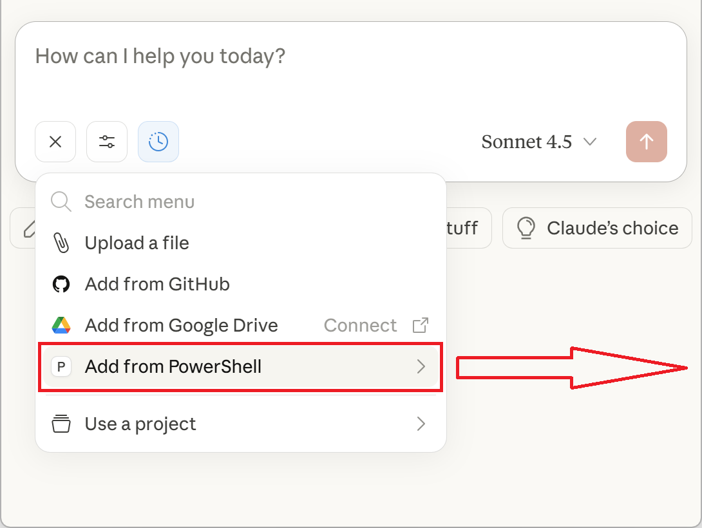
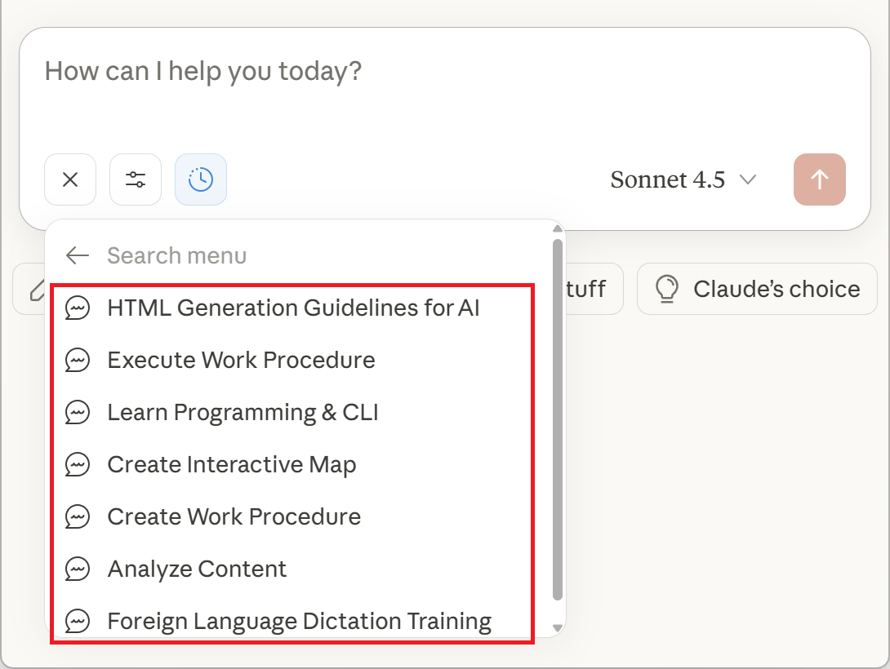
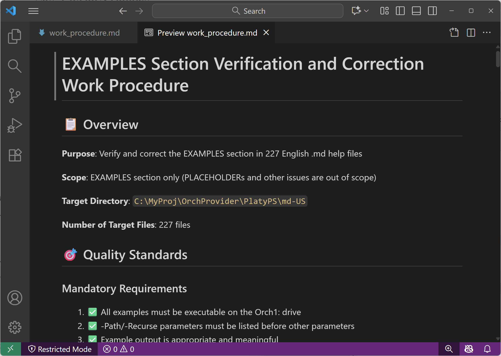
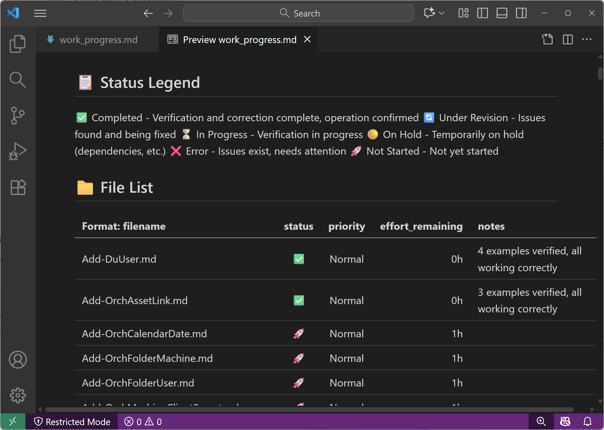
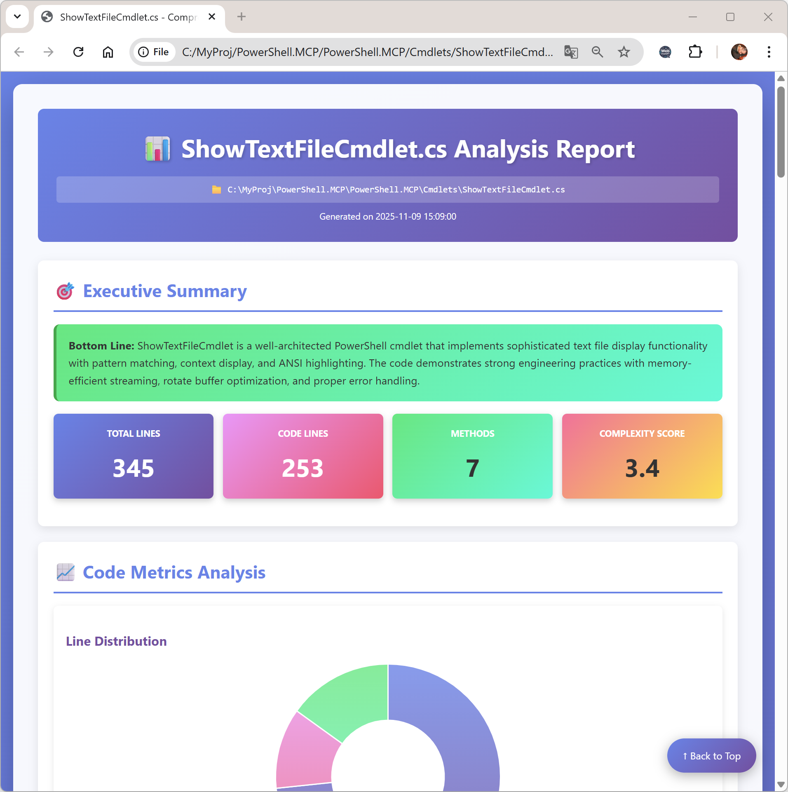
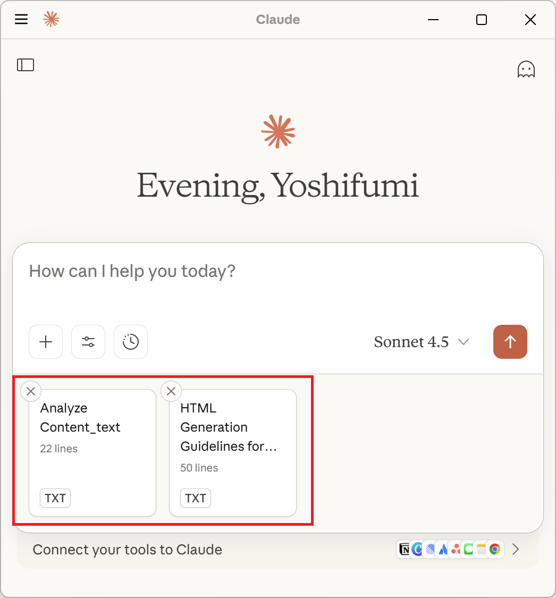
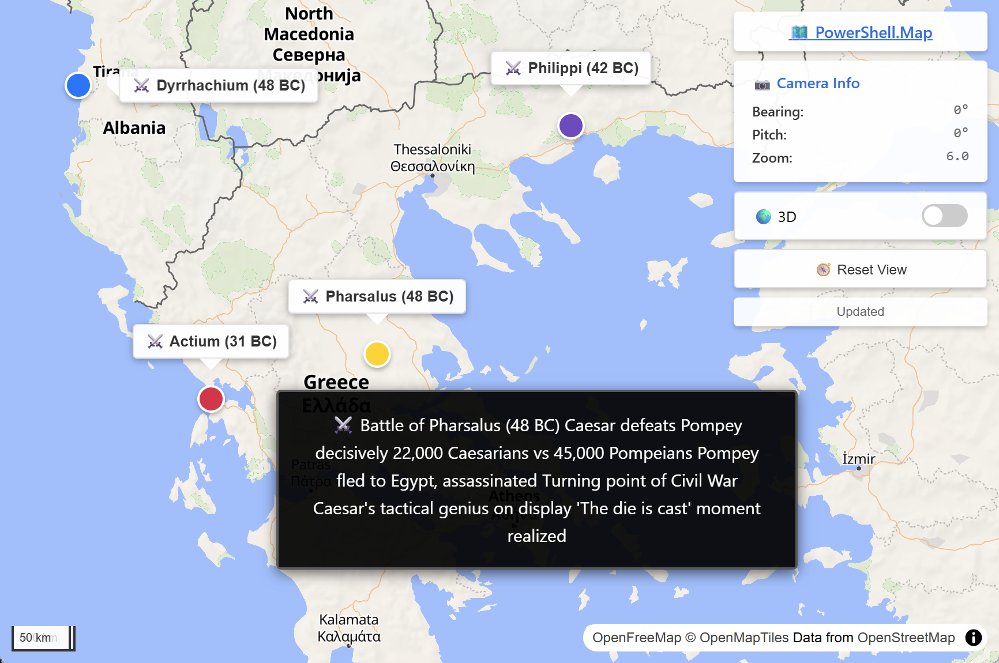
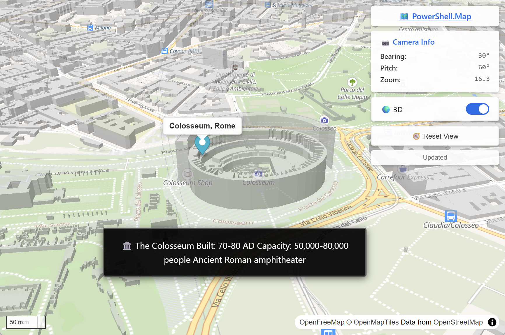

# PowerShell.MCP

[](https://github.com/PowerShell/PowerShell)
[](#prerequisites)
[](https://www.powershellgallery.com/packages/PowerShell.MCP)
[](https://www.powershellgallery.com/packages/PowerShell.MCP)
[](https://opensource.org/licenses/MIT)

**Security Warning:** This module provides complete PowerShell access to your system. Malicious use could result in severe damage. Use responsibly and only in trusted environments.

## Overview

*The universal MCP server—one installation gives AI access to 10,000+ PowerShell modules and any CLI tool.*

PowerShell.MCP connects AI assistants to the entire PowerShell ecosystem through a single MCP server. You and AI collaborate in the same PowerShell console—every command is visible, auditable, and saved to history.

## Why PowerShell.MCP?

**A universal gateway to the PowerShell ecosystem.**

PowerShell.MCP takes a different approach from service-specific MCP servers. Rather than providing curated tools for individual services, it gives AI assistants direct access to PowerShell—letting them use the same modules and CLI tools that professionals use every day.

This means:
- **One MCP server replaces many** — no need for separate servers for each service
- **Immediate access** to 10,000+ modules on [PowerShell Gallery](https://www.powershellgallery.com/) without waiting for dedicated MCP servers
- **Cross-service workflows** combining multiple services in a single pipeline
- **API exploration** — prototype and verify API behavior with immediate feedback before writing production code
- **Self-evolving capabilities** — AI writes PowerShell scripts that both AI and users can execute, continuously extending what's possible
- **Industry-standard skills** — commands you learn transfer directly to your own work

**Examples: PowerShell pipeline processing**

*"Show me bug issues from the PowerShell repo with their authors"*

```powershell
gh issue list --repo PowerShell/PowerShell --json title,author,labels |
    ConvertFrom-Json |
    Where-Object { $_.labels.name -contains "Issue-Bug" } |
    Select-Object title, @{N='by';E={$_.author.login}}
```

*"List my running Azure VMs with their sizes"*

```powershell
Get-AzVM -Status | Where-Object PowerState -eq "VM running" |
    Select-Object Name, @{N='Size';E={$_.HardwareProfile.VmSize}}, Location
```

*"Check if GitHub's API returns rate limit info"*

```powershell
Invoke-RestMethod https://api.github.com/rate_limit |
    Select-Object -ExpandProperty rate
```

*"Get the current user's Windows username via Win32 API"*

```powershell
Add-Type -MemberDefinition '[DllImport("advapi32.dll")] public static extern bool GetUserName(System.Text.StringBuilder sb, ref int len);' -Name Win32 -Namespace API
$sb = [System.Text.StringBuilder]::new(256); $len = 256
[API.Win32]::GetUserName($sb, [ref]$len); $sb.ToString()
```

PowerShell.MCP complements your existing MCP setup by providing a flexible, general-purpose foundation.

## What Makes It Powerful

**🖥️ Multi-Client Architecture**
- Each client instance gets its own exclusive console—run multiple Claude Code sessions in parallel
- Safe parallel operation with no resource conflicts
- Unique window titles (e.g., "#12345 Taxi") for easy identification
- `Get-MCPOwner` cmdlet shows which client owns the current console

**🤝 Shared Console Experience**
- You and AI collaborate in the same PowerShell session with full transparency
- Every command AI executes appears in your console in real-time
- You can respond to interactive prompts directly in the console
- Commands are saved to history—learn by watching AI work

**🔄 Persistent Session State**
- Authenticate once, stay authenticated: Azure, AWS, Microsoft 365, and more
- Modules, variables, and functions persist across commands
- No re-initialization overhead

**🌐 Universal Access**
- [PowerShell Gallery](https://www.powershellgallery.com/): 10,000+ modules including [Az](https://www.powershellgallery.com/packages/Az), [AWS.Tools](https://www.powershellgallery.com/packages/AWS.Tools.Common), [Microsoft.Graph](https://www.powershellgallery.com/packages/Microsoft.Graph)
- Any CLI tool: git, docker, kubectl, terraform, gh, az cli, aws cli
- AI learns syntax automatically via `Get-Help`

**🔗 Pipeline Composability**
- Describe what you want in natural language—AI constructs the optimal pipeline
- "Top 5 largest logs" → `Get-ChildItem *.log | Sort-Object Length -Descending | Select-Object -First 5`
- Chain any commands across any services

**⚡ Instant Execution**
- Commands execute immediately in an existing console
- No process startup overhead per command
- Real-time streaming output

**🔐 Enterprise-Ready Security**
- Local-only named pipe communication—no network exposure
- Every command visible and auditable
- Integrates with existing security policies

## Architecture

Five tools provide maximum flexibility with minimum complexity:

| Tool | Purpose |
|------|---------|
| `start_powershell_console` | Launch a persistent console for the MCP client |
| `get_current_location` | Get current directory and available drives |
| `invoke_expression` | Execute any PowerShell command or CLI tool |
| `wait_for_completion` | Wait for long-running commands to complete |
| `generate_agent_id` | Generate a unique agent ID for sub-agent console isolation |

## Quick Start

### Prerequisites

**All platforms require:**
- PowerShell 7.5+ ([installation guide](https://learn.microsoft.com/powershell/scripting/install/installing-powershell))
- Claude Desktop, Claude Code, or any MCP client

| Platform | OS Requirements |
|----------|-----------------|
| Windows | Windows 10/11 or Windows Server 2016+ |
| Linux | Ubuntu 22.04+, Debian 11+, RHEL 8+, or distributions with GUI desktop |
| macOS | macOS 12 (Monterey)+, Intel or Apple Silicon |

---

<details>
<summary><b>Windows Setup</b></summary>

#### 1. Open PowerShell 7
Press `Win + R`, type `pwsh`, press `Enter`

#### 2. Install PowerShell.MCP
```powershell
Install-Module PowerShell.MCP
```

#### 3. Configure your MCP client

**For Claude Code:**
```powershell
# Run in PowerShell (pwsh)
claude mcp add PowerShell -- "$(Get-MCPProxyPath)"
```

**For Claude Desktop** — Edit `%APPDATA%\Claude\claude_desktop_config.json`:
```powershell
# Run in PowerShell (pwsh)
Get-MCPProxyPath -Escape  # Example output: C:\\Users\\YourName\\...\\PowerShell.MCP\\...\\PowerShell.MCP.Proxy.exe
```
Paste the output into `claude_desktop_config.json` (replace the example path below with your actual output):
```json
{
  "mcpServers": {
    "PowerShell": {
      "command": "C:\\Users\\YourName\\...\\PowerShell.MCP\\...\\PowerShell.MCP.Proxy.exe"
    }
  }
}
```
#### 4. Restart your MCP client

</details>

<details>
<summary><b>Linux Setup</b></summary>

#### 1. Install PowerShell 7
```bash
# Ubuntu/Debian
sudo apt-get update
sudo apt-get install -y wget apt-transport-https software-properties-common
source /etc/os-release
wget -q https://packages.microsoft.com/config/ubuntu/$VERSION_ID/packages-microsoft-prod.deb
sudo dpkg -i packages-microsoft-prod.deb
sudo apt-get update
sudo apt-get install -y powershell
```

#### 2. Install PowerShell.MCP, set permissions, and configure your MCP client

**For Claude Code:**
```powershell
# Run in PowerShell (pwsh)
Install-Module PowerShell.MCP
chmod +x "$(Get-MCPProxyPath)"
claude mcp add PowerShell -- "$(Get-MCPProxyPath)"
```

**For Claude Desktop** — Edit `~/.config/Claude/claude_desktop_config.json`:
```powershell
# Run in PowerShell (pwsh)
Get-MCPProxyPath -Escape  # Example output: /home/YourName/.../PowerShell.MCP/.../PowerShell.MCP.Proxy
```
Paste the output into `claude_desktop_config.json` (replace the example path below with your actual output):
```json
{
  "mcpServers": {
    "PowerShell": {
      "command": "/home/YourName/.../PowerShell.MCP/.../PowerShell.MCP.Proxy"
    }
  }
}
```

#### 3. Restart your MCP client

</details>

<details>
<summary><b>macOS Setup</b></summary>

#### 1. Install PowerShell 7
```bash
brew install powershell/tap/powershell
```

#### 2. Install PowerShell.MCP, set permissions, and configure your MCP client

**For Claude Code:**
```powershell
# Run in PowerShell (pwsh)
Install-Module PowerShell.MCP
chmod +x "$(Get-MCPProxyPath)"
claude mcp add PowerShell -- "$(Get-MCPProxyPath)"
```

**For Claude Desktop** — Edit `~/Library/Application Support/Claude/claude_desktop_config.json`:
```powershell
# Run in PowerShell (pwsh)
Get-MCPProxyPath -Escape  # Example output: /Users/YourName/.../PowerShell.MCP/.../PowerShell.MCP.Proxy
```
Paste the output into `claude_desktop_config.json` (replace the example path below with your actual output):
```json
{
  "mcpServers": {
    "PowerShell": {
      "command": "/Users/YourName/.../PowerShell.MCP/.../PowerShell.MCP.Proxy"
    }
  }
}
```

#### 3. Restart your MCP client

</details>

---

## First-Time Demo

Experience PowerShell.MCP's capabilities:

- "Show what PowerShell.MCP can do in a colorful, dynamic, and fun demo"
- "Try out different styles of notifications using the BurntToast module"
- "Automate Notepad: type text and smoothly move the window in a circle"
- "How does it feel now that you have a tool like PowerShell.MCP?"

After trying these demos, explore the built-in prompts below or ask AI to explain any command.

## Built-in Prompts

PowerShell.MCP includes 7 specialized prompts accessible from your MCP client's prompts menu. Each prompt is designed for specific tasks and guides AI to provide optimal results.

<div align="center">
  <table cellspacing="0" cellpadding="0" border="0" width="100%">
    <tr>
      <td align="center" width="45%">
        
        <br/>
        <em>Built-in Prompts Menu</em>
      </td>
      <td width="3%"></td>
      <td align="center" width="45%">
        
        <br/>
        <em>Selecting a Prompt</em>
      </td>
    </tr>
  </table>
</div>

---

### 📋 Create Work Procedure + ⚙️ Execute Work Procedure
**Best for:** Complex, multi-step tasks you'll perform repeatedly

Work together as a powerful workflow system with automatic file management:

1. **Create Work Procedure** - AI analyzes the task and generates `work_procedure.md` as the reusable procedure and `work_progress.txt` as the execution plan.
2. **Execute Work Procedure** - AI follows and refines `work_procedure.md` during execution, and tracks and records outcomes in `work_progress.txt`.

**Key benefits:** self-refining procedures, resumable workflows, automatic progress tracking, consistent results

**Example:** "Write Get-Help markdown for multiple cmdlets through execution and verification"

<div align="center">
  <table cellspacing="0" cellpadding="0" border="0" width="100%">
    <tr>
      <td align="center" width="45%">
        
        <br/>
        <em>AI-generated work_procedure.md</em>
      </td>
      <td width="3%"></td>
      <td align="center" width="45%">
        
        <br/>
        <em>AI-generated work_progress.md</em>
      </td>
    </tr>
  </table>
</div>

---

### 📊 Analyze Content
**Best for:** Deep analysis of files, folders, or datasets

Generates comprehensive reports with insights and recommendations. Combine with **HTML Generation Guidelines for AI** for visual reports with charts.

**Examples:** "Analyze my project's log files" • "Create a report on this CSV dataset" • "Analyze this HAR file"

<div align="center">
  <table cellspacing="0" cellpadding="0" border="0" width="100%">
    <tr>
      <td align="center" width="45%">
        
        <br/>
        <em>C# code quality analysis report</em>
      </td>
      <td width="3%"></td>
      <td align="center" width="45%">
        
        <br/>
        <em>C# code quality analysis report (continued)</em>
      </td>
    </tr>
  </table>
</div>

---

### 🎨 HTML Generation Guidelines for AI
**Best for:** Professional HTML reports with charts and styling

Companion prompt that ensures AI generates high-quality HTML with Chart.js visualization, responsive design, and proper styling. Works with any prompt or task that needs HTML output.

**Examples:** Analyze Content + this = visual reports • Your custom prompt + this = professional HTML • Any data task + this = interactive output

<div align="center">
  
  <br/>
  <em>Combined prompts generate visual HTML file</em>
</div>

---

### 📚 Learn Programming & CLI
**Best for:** Learning programming languages and command-line tools at any level

Provides personalized learning experiences with clear explanations, practical examples, and hands-on exercises. Specify your learning goals directly without worrying about experience levels.

**Examples:** "Learn Python basics for data analysis" • "Learn Git commands for version control" • "Learn PowerShell scripting"

---

### 🗣️ Foreign Language Dictation Training
**Best for:** Improving listening skills in foreign languages

Creates dictation exercises with automatic checking.

**Examples:** "English dictation at beginner level" • "Japanese conversation at the zoo"

---

### 🗺️ Show Interactive Map
**Best for:** Visualizing geographic data or locations

Generates interactive HTML maps with markers, descriptions, and optional 3D display using [PowerShell.Map](https://github.com/yotsuda/PowerShell.Map) module.

**Examples:** "Show major Roman battles in chronological order" • "Create a map of hot springs in Japan"

<div align="center">
  <table cellspacing="0" cellpadding="0" border="0" width="100%">
    <tr>
      <td align="center" width="45%">
        
        <br/>
        <em>Roman Battle Locations</em>
      </td>
      <td width="3%"></td>
      <td align="center" width="45%">
        
        <br/>
        <em>Colosseum 3D Visualization</em>
      </td>
    </tr>
  </table>
</div>

---

## Platform Notes

### Windows
- PSReadLine module is automatically loaded for enhanced console experience
- Full color support for PowerShell output

### Linux
- Requires a GUI desktop environment (GNOME, KDE, XFCE, etc.)
- Supported terminal emulators: gnome-terminal, konsole, xfce4-terminal, xterm, lxterminal, mate-terminal, terminator, tilix, alacritty, kitty
- PSReadLine is automatically removed (not supported on Linux)

### macOS
- Works with Terminal.app (default)
- PSReadLine is automatically removed (not supported on macOS)
- Both Apple Silicon (M1/M2/M3/M4) and Intel Macs are supported

---

## Limitations

- **AI Command Cancellation**: Commands executed by AI cannot be cancelled with Ctrl+C. Close the console to stop.
- **User Command Privacy**: Commands you execute are not visible to AI assistants.
- **Verbose/Debug Streams**: Not captured. Share via clipboard if needed.
- **CLI stderr**: Not captured by default. Use `$result = & command.exe 2>&1` to capture.
- **External Command Colors**: Color output from some CLI tools may not be preserved (git colors are supported).

## Disclaimer

This software is provided "AS IS" without warranty of any kind, either expressed or implied.
The author assumes no responsibility for any damages arising from the use of this software.

## License

MIT License - see [LICENSE](LICENSE) for details.

## Author

Yoshifumi Tsuda

---

**For enterprise use, ensure compliance with your organization's security policies.**
