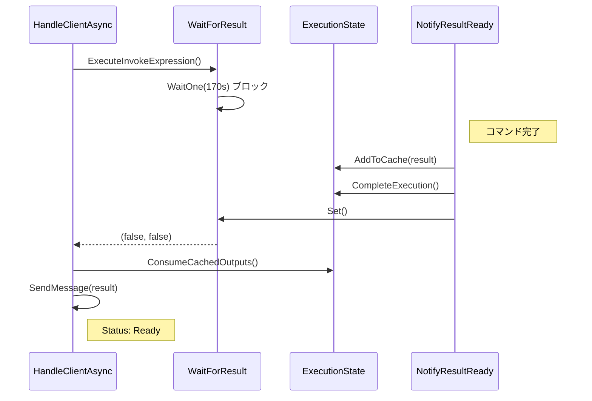
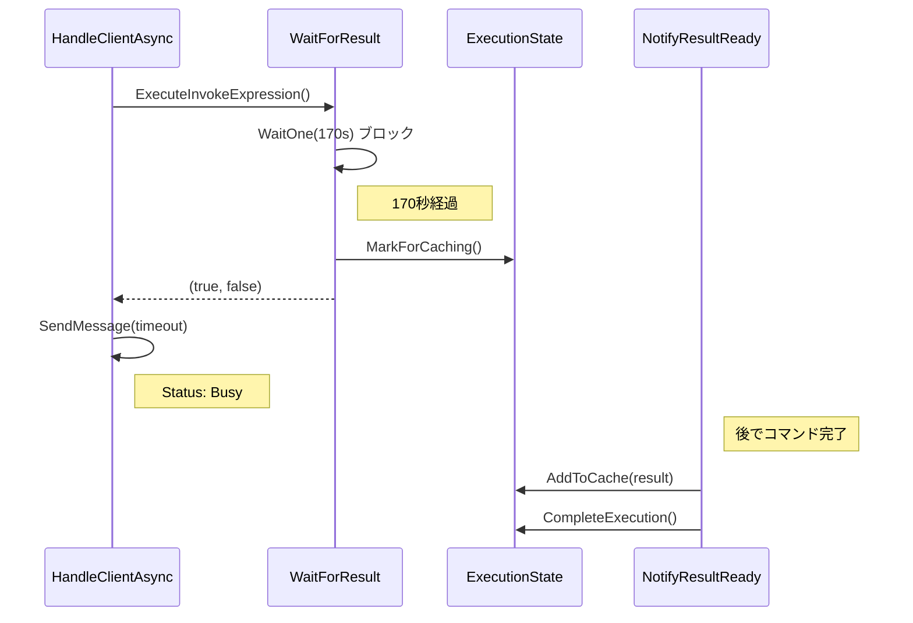
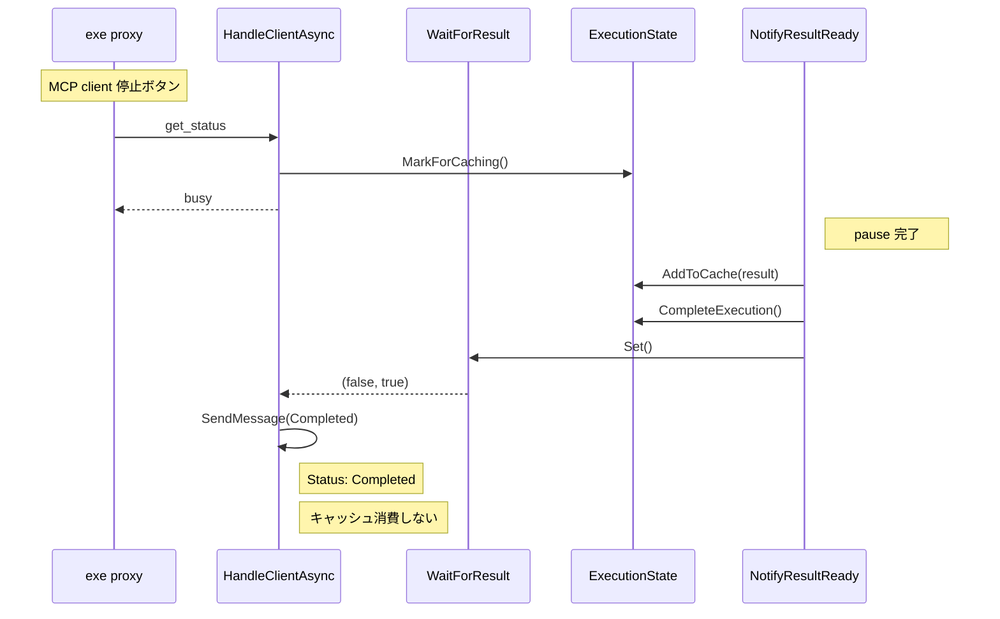
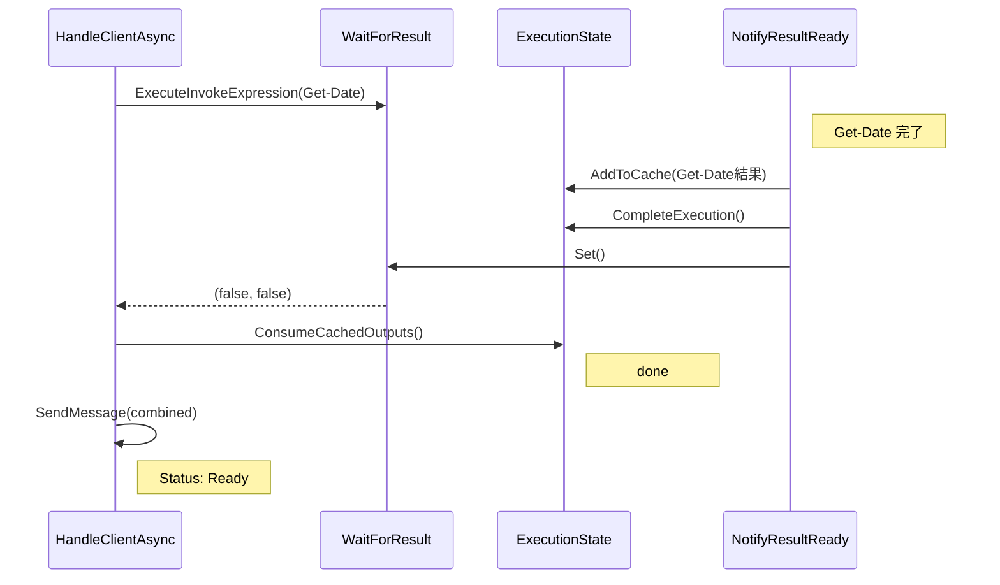

# NotifyResultReady から Named Pipe 応答までのフロー

## 設計概要

- `NotifyResultReady()` は常にキャッシュに追加
- `WaitForResult()` は `(isTimeout, shouldCache)` を返す
- Status の種類:
  - **Busy**: コマンド実行中（タイムアウト）
  - **Completed**: コマンド完了、キャッシュに保存済み（MCP client 切断済み）
  - **Ready**: コマンド完了、結果を返却

## 通常完了ケース

## タイムアウトケース

## 停止ボタンケース

## 停止後にスイッチしたとき

## 状態遷移

| 状態 | Status | キャッシュ消費 | 説明 |
|------|--------|--------------|------|
| 実行中 | Busy | しない | 170秒タイムアウト |
| 完了 (要キャッシュ) | Completed | しない | MCP client 切断済み |
| 完了 (通常) | Ready | する | 結果を返却 |
