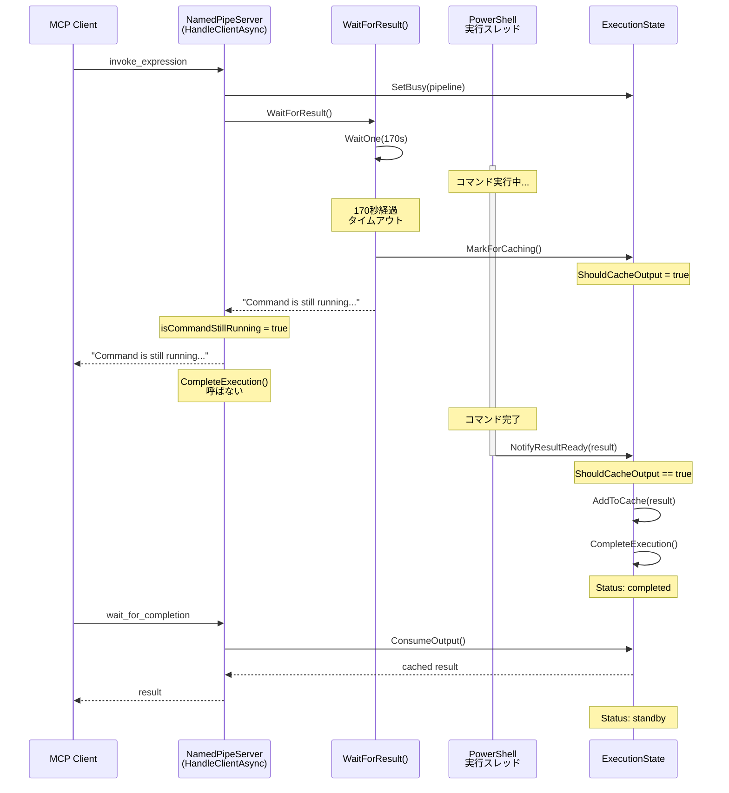

# タイムアウト時のフロー

## 状態遷移

| タイミング | _isBusy | ShouldCacheOutput | Status |
|-----------|---------|-------------------|--------|
| コマンド開始 | true | false | busy |
| 170秒タイムアウト | true | true | busy |
| コマンド完了 (NotifyResultReady) | false | false | completed |
| キャッシュ消費後 | false | false | standby |
